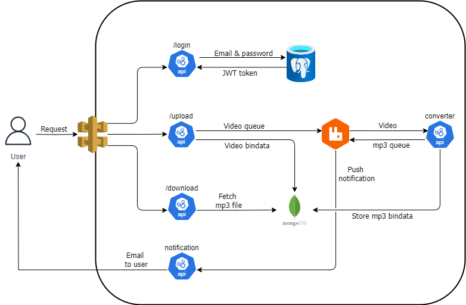
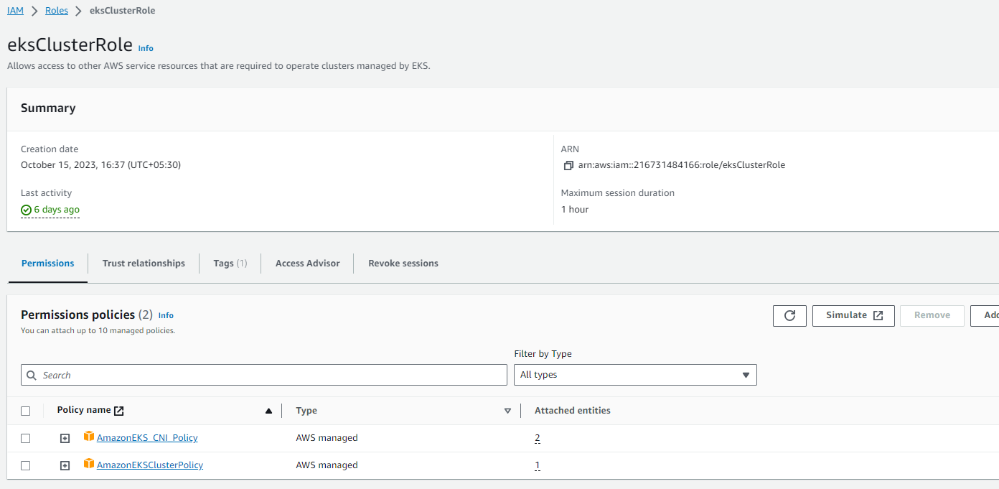
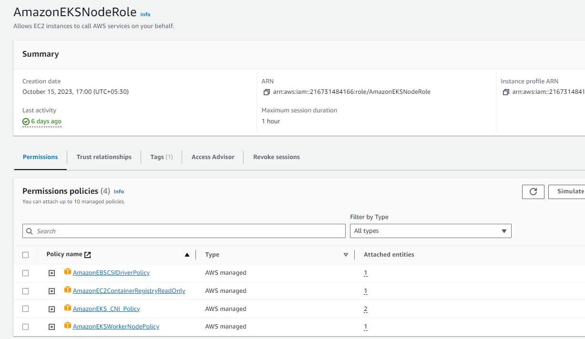
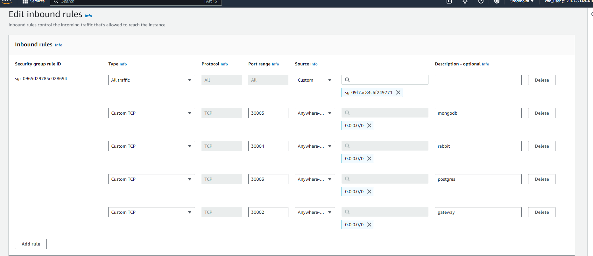
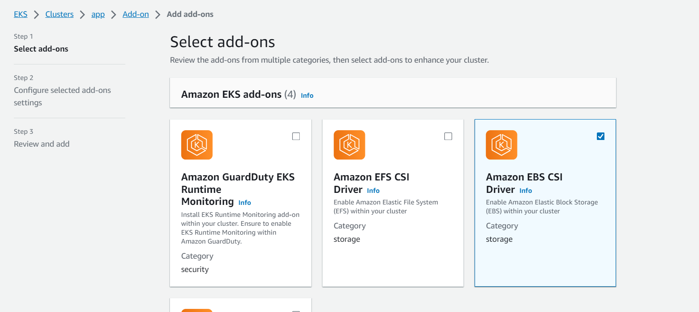
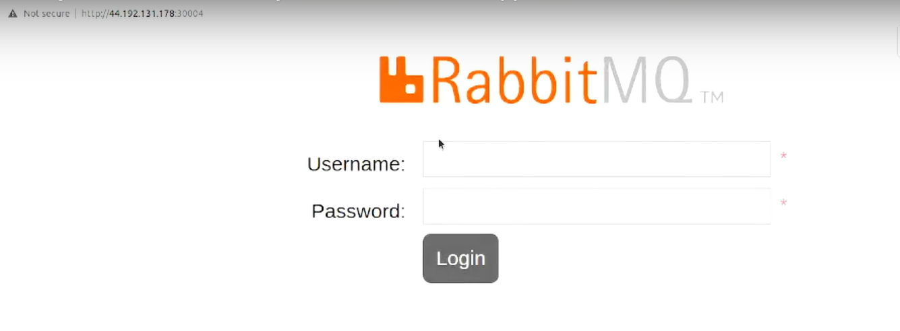

# Devops Project: Video to Audio Converter
convert video to audio using microservice architecture

## Architecture
<p align="center">
  
  </p>

## Deploying a Python-based Microservice Application on AWS EKS

### Introduction
The project aimed to deploy a Python-based microservice application on AWS Elastic Kubernetes Service (EKS) for video conversion. Leveraging Helm, the deployment included PostgreSQL and MongoDB databases to support the application's data needs. Additionally, RabbitMQ was integrated into the architecture to handle asynchronous messaging. The microservices were divided into four major components:

- `auth-server`: Responsible for handling user authentication and authorization.
- `converter-module`: Core microservice for converting video files from mp4 format to mp3.
- `database-server`: Manages the storage and retrieval of data in PostgreSQL and MongoDB databases.
- `notification-server`: Send notification to the user via email after video conversion done.

### Skills Learned

- **Python**: use to develop the program and use Flask to build RESTful API endpoint of microservices.
- **AWS services**: understand the basics of EKS, IAM Roles and networking configuration.
- **Container Orchestration**: utilizing Kubernetes for managing containerized application.
- **Infrastructure as Code**: Implementing infrastructure setup using Helm and AWS CLI.
- **Database Management**: setting up and configuring database (PostgreSQL and MongoDB) using Helm chart.
- **Message Queueing**: Intergrating RAbbitMQ for asynchrounous messaging, ensuring reliable communication between microservice.
- **Security Measures**: Implementing user authentication and authorization mechanisms, including JWT token generation and validation.

## Steps

### Prerequisites
Before you start, make sure following prerequisites are met:
**
1. **Create AWS Account**
2. **Install Helm**
3. **Install Python**
4. **Install AWS CLI**
5. **Install Kubectl**
6. **Setup PostgreSQL and MongoDB**

### Step-by-step

1. **Login to WS console** 🔑
   - Access the AWS console with your credential or create new account.

2. **Create eksCluster IAM Role**👨‍✈️
   - Follow the steps mentioned in [this](https://docs.aws.amazon.com/eks/latest/userguide/service_IAM_role.html) documentation using root user.
   - Please attach `AmazonEKS_CNI_Policy` explicitly if it is not attached by default.
   - After created it will look like this:

    <p align="center">
    
    </p>
     
3. **Create Node Role -AmazonEKSNodeRole**👩‍🎓
    - Follow the steps mention in [this](https://docs.aws.amazon.com/eks/latest/userguide/create-node-role.html#create-worker-node-role) documentaion useing root user.
    - We are using default VPC for this project thus no need to configure new VPC.
    - Once your role created, attach these policies `AmazonEKS_CNI_Polocy` , `AmazonEBSCSIDriverPolicy` , and `AmazonEC2ContainerRegistryReadOnly` incase it is not attached by default.
    - The AmazonEKSNodeRole will look like this
   
    <p align="center">
    
    </p>

4. **Open EKS Dashboard**
    - Find EKS service inside AWS Console dashboard.

5. **Create EKS Cluster**
    - Click "Create Cluster".
    - Name your cluster as "Microservice".
    - Setup networking setting for VPN and subnet.
    - Select `eksCluster` IAM role we created before.
    - Review and create cluster.

6. **Cluster Creation** ⏱
    - Wait until cluster status show "Active", then can start create node groups.

7. **Node Group Creation**
    - In "Compute" section inside the cluster, click on "Add node group".
    - Choose the AMI(default), instance type(t3.medium) and the number of nodes(desire:1,minimum:1,maximum:1).
    - For subnet, use default.
  
8. **Adding Inbound rule to Nodes's Security Group**
    - To ensure that nessesary ports are open for inbound traffic.

   <p align="center">
     

9. **Enable EBS CSI Addon**
    - Enable addon `EBS container storage interface` to allow EKS cluster to use EBS in AWS as persistence storage.
  
   <p align="center">
     

10. **Deploy application on EKS Cluster**
    - Clone the Python code from my repository.
    - **Connect with EKS cluster**:
      ```
      aws eks update-kubeconfig --name <cluster name> --region <cluster region>
      ```
    - for this case :
      ```
      aws eks update-kubeconfig --name Microservice --region us-east-1
      ```
    - To check if the connection is OK, enter
      ```
      kubectl get ns
      ```
      It will list down "default namespace" if the connection is good.
      
    **NOTE:** Before this command execute, your kubectl manage the kubernetes in your pc. After executed, kubectl will manage the cluster in AWS.

11. **Install MongoDB in Node** 
     - MongoDB is use for storing video and audio file.
     - MongoDB folder contain:
         - **chart**: a configuration file we set up that need to be install in cluster using helm.
         - **value**: it store username and password to login to mongo, can change password here.
         - **template folder**: contain some configuration for pod including pv.yaml.
    
     - Install MongoDB
     ```
     cd Helm_charts/MongoDB
     helm install mongo .
     ```
     - To check wether the pod that run the MongoDB is running or not. These two command will show all pod status inside the cluster:
    ```
    kubectl get pods
    ```
    ```
    kubectl get all
    ```
    - Actually the we also define a persistence volume for the pod, to check pv status :
    ```
    kubectl get pv
    ```
    - Connect to MongoDB instance:
     ```
     mongosh mongodb://<username>:<pwd>@<nodeip>:30005/mp3s?authSource=admin
     ```
     **NOTE:** `helm` command is use to install MongoDB, Postgres and RabbitMQ inside Kubernetes cluster based on Helm chart that was written in yaml.

12. **Install Postgres**
     - About Postgres
       - Postgres is use for user authentication.
       - You can set the username and password in "values.yaml".
       - If you like to receive email notification, you can set your email in "init.sql" as well as in "/src/notification-service/manifest/secret.yaml".
       - As for how to create the gmail password, you can follow the step [here](https://youtu.be/g8X5AoqCJHc?t=4222).
     - Install Postgres
      ```
      cd Helm_charts/Postgres
      helm install postgres .
      ```
13. **Connect to Postgres**
     - Run the command in CLI to connect with Postgres. Nodeip you can get at node's ec2 public ip.
      ```
      psql 'postgres://<username>:<pwd>@<nodeip>:30003/authdb'
      ```
     - When connected to postgres, you will be in `authdb=#`. Here you can perform SQL query such as `\d` to show any relation available inside the database. Once you run the query it will show that there is no relation inside it since we havent create any table yet.
     - To create the table for authentication, copy the query inside Postgres/templates/init.sql and paste it in `authdb=#`.
     - This query will create a new table and insert one email and user password. Run `\d ` and it will show any table available.
    <p align="center">
      
    </p>

     - Run `SELECT * FROM auth_user` to show what inside the table. `\q` to quit.

14. **Deploy RabbitMQ**
     - Deploy RabbitMQ by running:
      ```
      helm install rabbitmq .
      ```
     - Run `\d` and observe that the port for RabbitMQ is 30004.
     - To open the rabbitMQ interface, open browser and search for:
      ```
      http://<node-ip>:30004
      ```
     <p align="center">
       
     </p >
     - By default, the username and password is `guest`

15. **Create Queue**
     - Once login, go to "queue". We need to create 2 queue, *mp3* and *video*
     - In queue page, add new queue
        - type: Classic
        - name: mp3
      - Click "Add Queue". Repeat same step for *video*, just change the name.
   
16. **Build Docker Image**
     - Inside the `src/auth-service` folder contain a Dockerfile.
     - You have option whether to create Docker Image from this Dockerfile and push it to Docker Hub or use readily available image in DockerHub that use python base like *python:3.10-slim*.
     - Cd to auth-service folder and run this command to build image:
       ```
       docker build -t auth .
       ```
     - run this command to see if the `auth` image have been build:
       ```
       docker images
       ```
     - Before push the image to Docker Hub, check if you are login or not, if not please login:
       ```
       docker login
       ```
     - Tag the image with your account name: `docker tag <local-image>:<tagname> <new-repo:tagname>`
       ```
       docker tag auth:latest aris/auth
       ```
     -  Check again the image with `docker images` and see if "aris/auth" image is available
     -  **Push** the image to DockerHub
       ```
        docker push aris/auth
       ```

17. **Apply Microservice Manifest File on Kubernetes**
     - Manifest file is use to declare the desire state of your application or infrastructure in kubernetes.
     - cd to **auth-service/manifest** file and run this command:
       ```
       kubectl apply -f .
       ```
     - If you run `kubectl get all` then you can see there are 2 auth pods were created as stated in development file.
     - Same for **gateway, converter and notification**, cd to their manifest file and run the `kubectl apply` command.
       
     **NOTES**: You can always scale up or down the number of replica(pod) for each microservice using this command:
       ```
       kubectl scale deployment converter --replicas 2
       ```
     - So for "converter", instead of using 4 pods now we scale it to 2.


